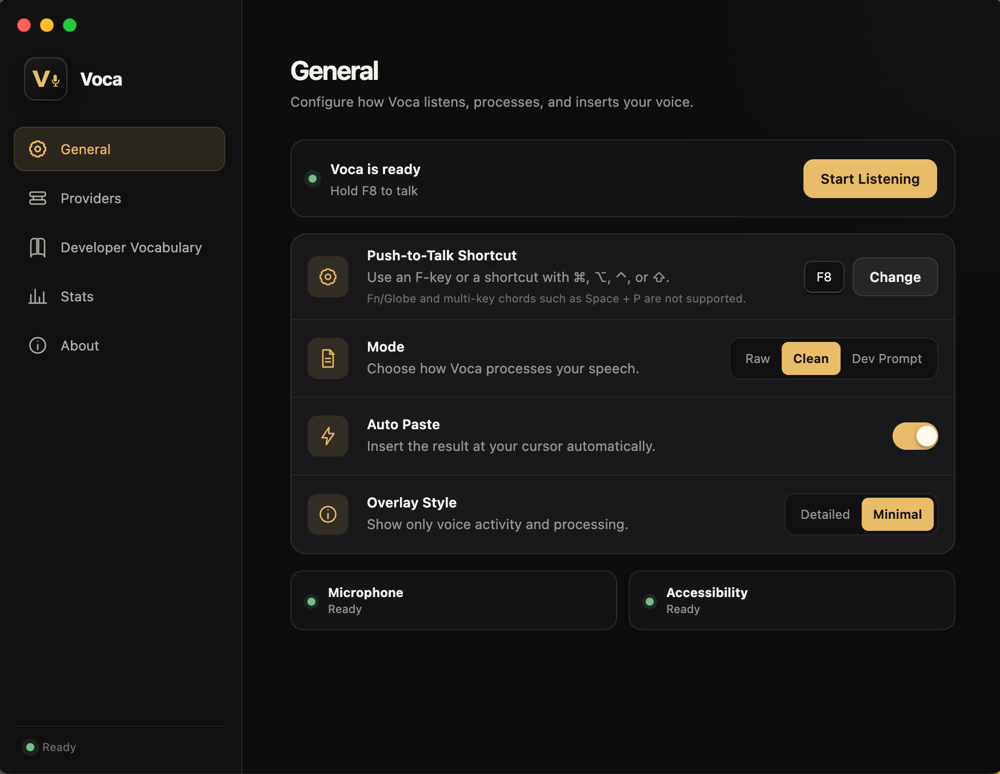
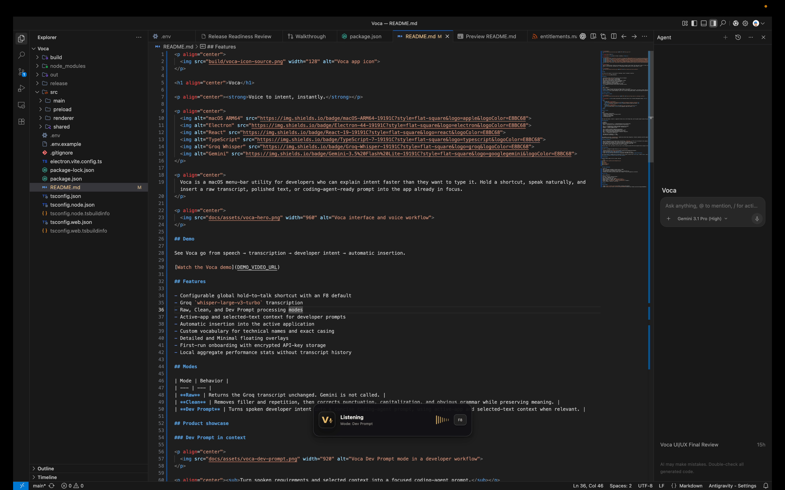
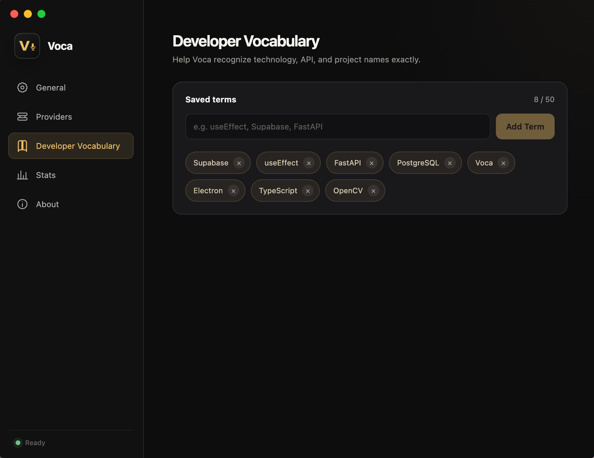
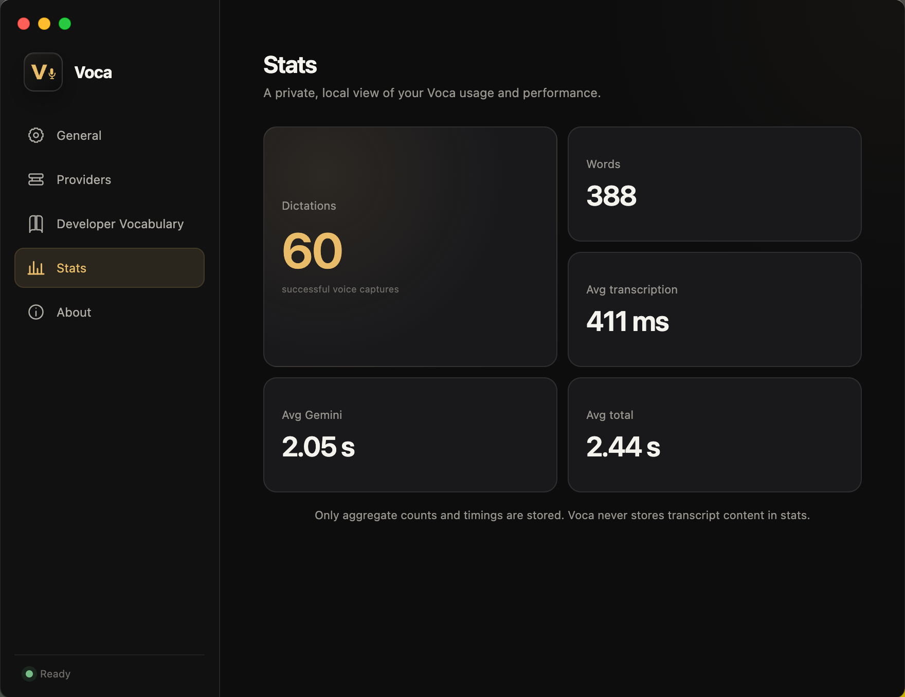
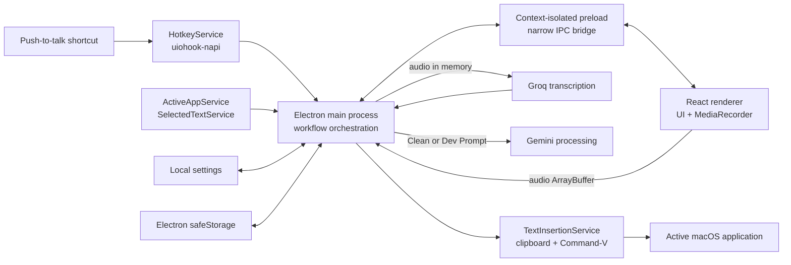

<p align="center">
  
</p>

<h1 align="center">Voca</h1>

<p align="center">
  <strong>Voice to intent, instantly.</strong>
</p>

<p align="center">
  
  
  
  
  
  
  <a href="https://github.com/krishadya/Voca/releases/latest">
    
  </a>
</p>

<p align="center">
  Voca is a macOS menu-bar utility that turns natural speech into raw transcripts,
  polished text, or structured developer prompts and inserts the result directly
  into the app you're already using.
</p>

<p align="center">
  <a href="https://krishadya.github.io/Voca/"><strong>Website</strong></a>
  ·
  <a href="https://github.com/krishadya/Voca/releases/latest"><strong>Download</strong></a>
  ·
  <a href="https://github.com/krishadya/Voca"><strong>GitHub</strong></a>
</p>

<p align="center">
  
</p>

## Demo

See Voca go from **speech → transcription → developer intent → automatic insertion**.

[Watch the Voca demo](DEMO_VIDEO_URL)

## Features

- Configurable global hold-to-talk shortcut with an F8 default
- Groq `whisper-large-v3-turbo` transcription
- Raw, Clean, and Dev Prompt processing modes
- Active-app and selected-text context for developer prompts
- Automatic insertion into the active application
- Custom developer vocabulary for technical names and casing
- Detailed and Minimal floating overlays
- First-run onboarding with encrypted API-key storage
- Local aggregate performance stats without transcript history

## Modes

| Mode | Behavior |
| --- | --- |
| **Raw** | Returns the Groq transcript unchanged. Gemini is not called. |
| **Clean** | Removes filler and repetition while correcting punctuation, capitalization, and obvious grammar without changing meaning. |
| **Dev Prompt** | Turns spoken developer intent into a concise coding-agent prompt using active-app and selected-text context when relevant. |

## Product showcase

### Dev Prompt in context

<p align="center">
  
</p>

<p align="center">
  <sub>Turn spoken requirements and surrounding context into a focused coding-agent prompt.</sub>
</p>

<table>
  <tr>
    <td width="50%" align="center">
      
      <br>
      <sub><strong>Developer Vocabulary</strong><br>Preserve technical names and exact casing.</sub>
    </td>
    <td width="50%" align="center">
      
      <br>
      <sub><strong>Local Stats</strong><br>Track aggregate usage and latency.</sub>
    </td>
  </tr>
</table>

## How it works

```text
Voice
  → Groq Whisper transcription
  → optional selected-text + active-app context
  → Gemini intent processing
  → clipboard + native paste
  → active application
```

Raw mode skips Gemini. Selected-text and active-app context are used only in Dev Prompt mode.

## Architecture



The renderer runs with `contextIsolation` enabled and without Node integration. Provider credentials and API requests remain in the main process behind a narrowly scoped preload bridge.

## Privacy & Security

- Groq and Gemini API keys are encrypted locally with Electron `safeStorage`.
- Audio is processed in memory and is not saved to disk by Voca.
- Transcript content is not persisted.
- Transcript logging is disabled in packaged builds.
- Only aggregate counts and latency data are stored for Stats.
- Voca has no accounts, backend, analytics service, or database.

Relevant audio, text, and context are still sent to the configured provider APIs when required and are subject to their respective policies.

## Installation

The latest release, **Voca v0.1.1**, is currently packaged for Apple Silicon Macs as:

```text
Voca-0.1.1-arm64.dmg
```

1. Download the latest DMG from [GitHub Releases](https://github.com/krishadya/Voca/releases/latest).
2. Open it and drag **Voca** into **Applications**.
3. Launch Voca and complete onboarding with your own Groq and Gemini API keys.
4. Grant **Microphone** and **Accessibility** permission. Some Macs may also require **Input Monitoring**.

### Gatekeeper

The current build is unsigned and not notarized.

On first launch, macOS may block Voca. Control-click **Voca.app**, choose **Open**, and confirm.

If it is still blocked, go to:

**System Settings → Privacy & Security → Open Anyway**

## Development

Requires macOS, Node.js 22.12 or newer, and npm.

```bash
git clone https://github.com/krishadya/Voca.git
cd Voca

npm install
npm run dev
```

Validation:

```bash
npm run typecheck
npm run build
```

## Known limitations

- macOS only
- The current release is packaged for Apple Silicon / ARM64
- The app and DMG are unsigned and not notarized
- Groq and Gemini require internet access and user-provided API keys
- Fn/Globe and arbitrary multi-key chords such as `Space + P` are not supported as shortcuts

## Tech stack

| Area | Technology |
| --- | --- |
| Desktop | Electron, Electron Builder |
| UI | React, TypeScript, CSS |
| Build | electron-vite, Vite, npm |
| Speech-to-text | Groq API, `whisper-large-v3-turbo` |
| Intent processing | Gemini API |
| Global input | `uiohook-napi`, Electron `globalShortcut` fallback |
| Secure storage | Electron `safeStorage` |

## Author

**Krish Adya**

- GitHub: [github.com/krishadya](https://github.com/krishadya)
- Portfolio: [krish.copasite.in](https://krish.copasite.in)
- LinkedIn: [linkedin.com/in/krish-adya-91a4822b3](https://www.linkedin.com/in/krish-adya-91a4822b3/)